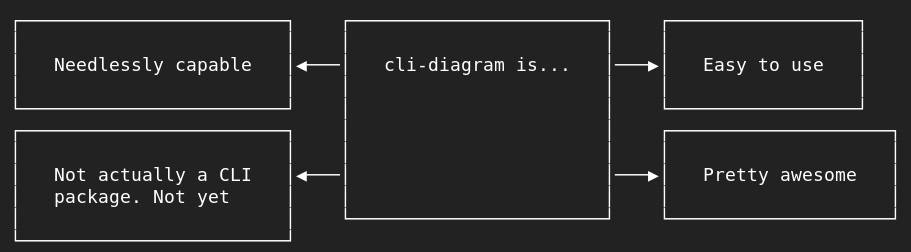

# CLI Diagram

Draw needlessly complex diagrams in the console.



## Install

```shell
npm install cli-diagram
```

## Getting started

```javascript
const Diagram = require('cli-diagram');

const myDiagram = new Diagram()
    .box(`Amazing`)
    .line(1)
    .box(`Isn't it?`);

console.log(myDiagram.draw());
```

```plain
┌─────────────┐    ┌───────────────┐
│             │    │               │
│   Amazing   │────│   Isn't it?   │
│             │    │               │
└─────────────┘    └───────────────┘
```

[More examples in this test file](./test/integration/diagram.js);

## Elements

Diagrams are build from elements. There is a variety of elements available to mix and match.

### Box

Draw an outlined box with some string contents. Content can be multiline. Boxes are flexible enough to contain other diagrams allowing you to create complex nested structures.

```javascript
.box('Hello, box!')
.box(content, options)
```

```plain
┌─────────────────┐
│                 │
│   Hello, box!   │
│                 │
└─────────────────┘
```

#### Options

`size {integer}`: The padding of the box.

`color {string}`: The color of the box including the outline and contents.

### Line

Draw one or more lines to link elements. Lines spread out to take advantage of the available height.

```javascript
.line(3)
.line(count, options)
```

```plain
────
────
────
```

#### Labels

You can add labels to lines.

```javascript
.line(['Hello, line!', null, 'Hi there'])
.line([label, label, ...])
```

```plain
──┤Hello, arrow!├──
───────────────────
──┤Hi there     ├──
```

#### Options

`size {integer}`: The width of the lines.

`color {string}`: The color of the lines.

### Arrow

Draw one or more arrows to link elements. Arrows spread out to take advantage of the available height.

```javascript
.arrow(['<--', '-->', '<->'])
.arrow([arrow, arrow, ...], options)
```

```plain
◀───
───▶
◀──▶
```

#### Styles

There are multiple styles of arrows available. You can mix and match any of the inputs from the first two columns in the table below.

```javascript
.arrow(['left', '--x', 'o-o'])
```

```plain
◀───
───X
O──O
```

| Input text       | Input symbolic | Result |
|------------------|----------------|--------|
| `'left'`         | `'<--'`        | `◀───` |
| `'right'`        | `'-->'`        | `───▶` |
| `'both'`         | `'<->'`        | `◀──▶` |
| `'broken-left'`  | `'x--'`        | `X───` |
| `'broken-right'` | `'--x'`        | `───X` |
| `'broken-both'`  | `'x-x'`        | `X──X` |
| `'round-left'`   | `'o--'`        | `O───` |
| `'round-right'`  | `'--o'`        | `───O` |
| `'round-both'`   | `'o-o'`        | `O──O` |

#### Labels

You can add labels to arrows.

```javascript
.arrow(['<--:Hello, arrow!', '<--', '-->:Hi there'])
.arrow([arrow, arrow, ...])
```

```plain
◀─┤Hello, arrow!├──
◀──────────────────
──┤Hi there     ├─▶
```

#### Options

`size {integer}`: The width of the arrows.

`color {string}`: The color of the arrows.

### Space

Add some space between elements.

```javascript
.space(2)
.space(width)
```

```plain

```

### Container

A borderless box with some string contents and no padding. Content can be multiline. Containers are flexible enough to contain other diagrams allowing you to create complex nested structures.

```javascript
.container('Hello, container!')
.container(content, options)
```

```plain
Hello, container!
```

#### Options

`color {string}`: The color of the containers contents.

## Contributing

Contributors are always welcome! I don't care if you are a beginner or an expert, all help is welcome.

## Testing cli-diagram

First, clone the repository and install the dependencies. Then run the test script:

```plain
npm test
```

Sometimes things are just that simple.
